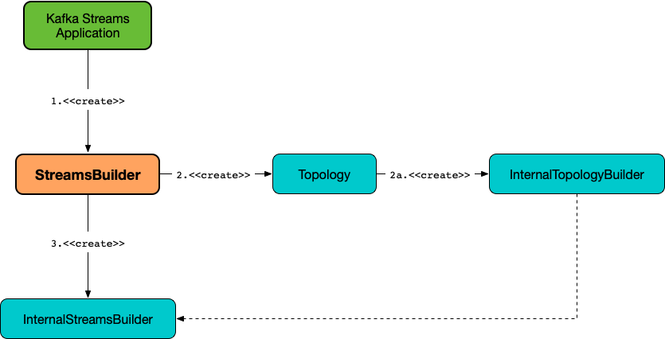

# StreamsBuilder

`StreamsBuilder` is the entry point to the [High-Level Streams DSL](index.md) to define and build a [stream processing topology](#topology).

All of the high-level operators use the [InternalStreamsBuilder](InternalStreamsBuilder.md) behind the scenes. In other words, `StreamsBuilder` offers a more developer-friendly high-level API for developing Kafka Streams applications than using the `InternalStreamsBuilder` API directly (and is a façade of `InternalStreamsBuilder`).

!!! note "Scala API for Kafka Streams"
    Use [Scala API for Kafka Streams](../scala.md) to make your Kafka Streams development more pleasant with Scala.

## Creating Instance

`StreamsBuilder` takes no arguments to be created.

```scala
import org.apache.kafka.streams.scala.StreamsBuilder
val builder = new StreamsBuilder
```

While being created, `StreamsBuilder` creates an empty [Topology](#topology) that in turn is requested for an [InternalTopologyBuilder](#internalTopologyBuilder). In the end, `StreamsBuilder` creates an [InternalStreamsBuilder](#internalStreamsBuilder).



## <span id="topology"> Topology

`StreamsBuilder` creates a [Topology](../Topology.md) when [created](#creating-instance).

`StreamsBuilder` uses the `Topology` to create an [InternalTopologyBuilder](#internalTopologyBuilder).

The `Topology` is then optimized and returned when `StreamsBuilder` is requested to [build a topology](#build).

## <span id="build"> Building and Optimizing Topology

```java
Topology build() // (1)
Topology build(
  Properties props)
```

1. Uses undefined properties (`null`)

`build` requests the [InternalStreamsBuilder](#internalStreamsBuilder) to [build and optimize a topology](InternalStreamsBuilder.md#buildAndOptimizeTopology). In the end, `build` returns the [Topology](#topology).

## <span id="globalTable"> globalTable

```java
GlobalKTable<K, V> globalTable(
  String topic)
GlobalKTable<K, V> globalTable(
  String topic,
  Consumed<K, V> consumed)
GlobalKTable<K, V> globalTable(
  String topic,
  Consumed<K, V> consumed,
  Materialized<K, V, KeyValueStore<Bytes, byte[]>> materialized)
GlobalKTable<K, V> globalTable(
  String topic,
  Materialized<K, V, KeyValueStore<Bytes, byte[]>> materialized)
```

`globalTable` adds a [GlobalKTable](GlobalKTable.md) to a topology.

### <span id="globalTable-demo-non-queryable"> Demo: Non-queryable GlobalKTable

```scala
import org.apache.kafka.streams.scala._
import ImplicitConversions._
import serialization.Serdes._

import org.apache.kafka.streams.scala.StreamsBuilder
val builder = new StreamsBuilder
```

```scala
val globalTable = builder.globalTable[String, String](topic = "demo-global-table")
```

```scala
scala> :type globalTable
org.apache.kafka.streams.kstream.GlobalKTable[String,String]
```

```scala
assert(globalTable.queryableStoreName == null)
```

```scala
val topology = builder.build()
```

```text
scala> println(topology.describe)
Topologies:
   Sub-topology: 0 for global store (will not generate tasks)
    Source: KSTREAM-SOURCE-0000000001 (topics: [demo-global-table])
      --> KTABLE-SOURCE-0000000002
    Processor: KTABLE-SOURCE-0000000002 (stores: [demo-global-table-STATE-STORE-0000000000])
      --> none
      <-- KSTREAM-SOURCE-0000000001
```

### <span id="globalTable-demo-queryable"> Demo: Queryable GlobalKTable

```scala
import org.apache.kafka.streams.scala._
import ImplicitConversions._
import serialization.Serdes._

import org.apache.kafka.streams.scala.StreamsBuilder
val builder = new StreamsBuilder
```

```scala
import org.apache.kafka.streams.state.Stores
val supplier = Stores.inMemoryKeyValueStore("queryable-store-name")

import org.apache.kafka.streams.scala.kstream.Materialized
val materialized = Materialized.as[String, String](supplier)
val zipCodes = builder.globalTable[String, String](topic = "zip-codes", materialized)
```

```text
scala> :type zipCodes
org.apache.kafka.streams.kstream.GlobalKTable[String,String]
```

```scala
assert(zipCodes.queryableStoreName == "queryable-store-name")
```

```scala
val topology = builder.build()
```

```text
scala> println(topology.describe)
Topologies:
   Sub-topology: 0 for global store (will not generate tasks)
    Source: KSTREAM-SOURCE-0000000000 (topics: [zip-codes])
      --> KTABLE-SOURCE-0000000001
    Processor: KTABLE-SOURCE-0000000001 (stores: [queryable-store-name])
      --> none
      <-- KSTREAM-SOURCE-0000000000
```

## <span id="stream"> stream

```java
KStream<K, V> stream(
  Collection<String> topics)
KStream<K, V> stream(
  Collection<String> topics,
  Consumed<K, V> consumed)
KStream<K, V> stream(
  Pattern topicPattern)
KStream<K, V> stream(
  Pattern topicPattern,
  Consumed<K, V> consumed)
KStream<K, V> stream(
  String topic)
KStream<K, V> stream(
  String topic,
  Consumed<K, V> consumed)
```

`stream` requests the [InternalStreamsBuilder](#internalStreamsBuilder) to [stream](InternalStreamsBuilder.md#stream).

### <span id="stream-demo"> Demo: Custom Processor Name

```scala
import org.apache.kafka.streams.scala._
import org.apache.kafka.streams.scala.kstream._
import ImplicitConversions._
import serialization.Serdes._

import org.apache.kafka.streams.scala.StreamsBuilder
val builder = new StreamsBuilder
```

```scala
implicit val consumed = Consumed.`with`[String, String].withName("processorName")
val demo = builder.stream[String, String]("demo")
```

```text
scala> println(builder.build().describe)
Topologies:
   Sub-topology: 0
    Source: processorName (topics: [demo])
      --> none
```
